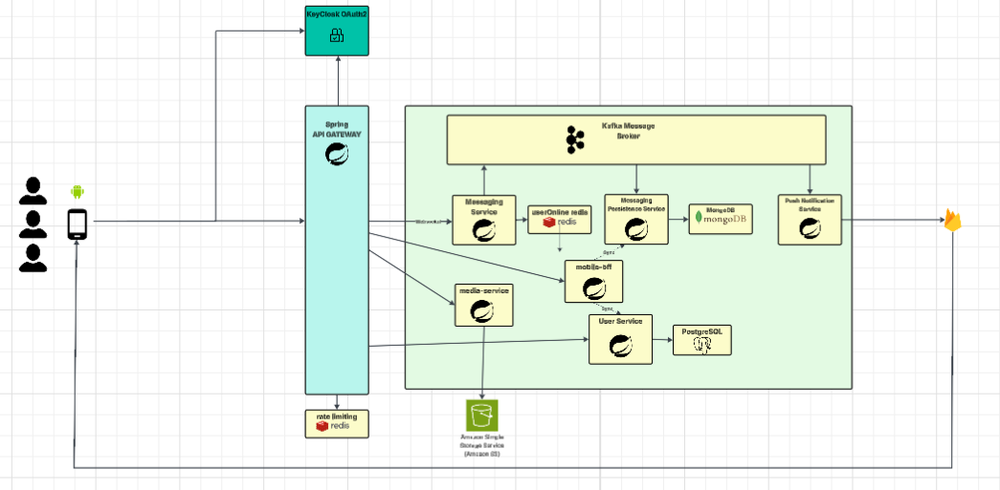
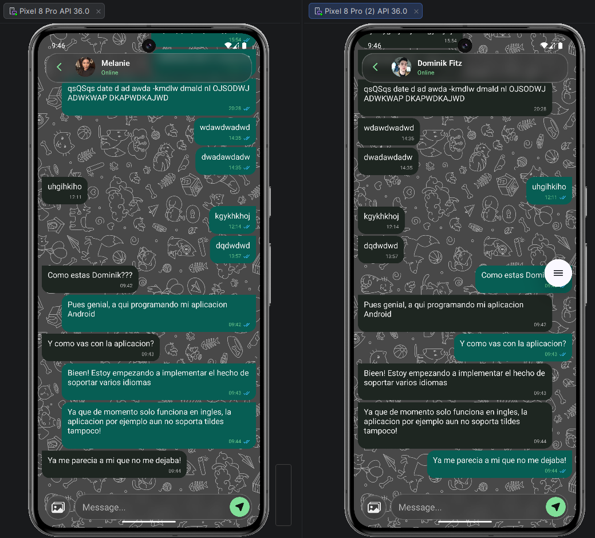
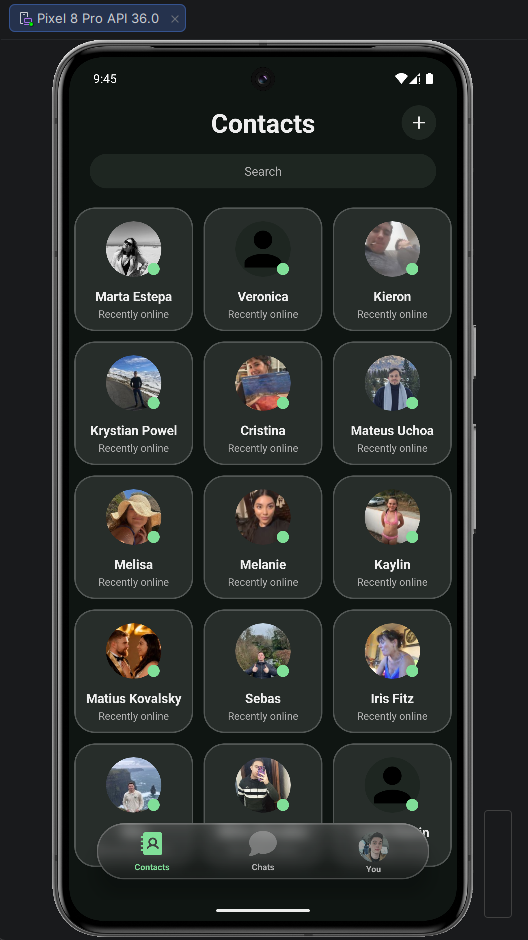
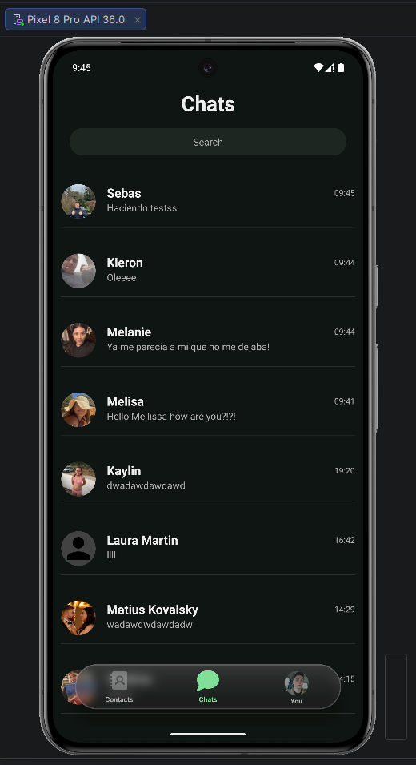
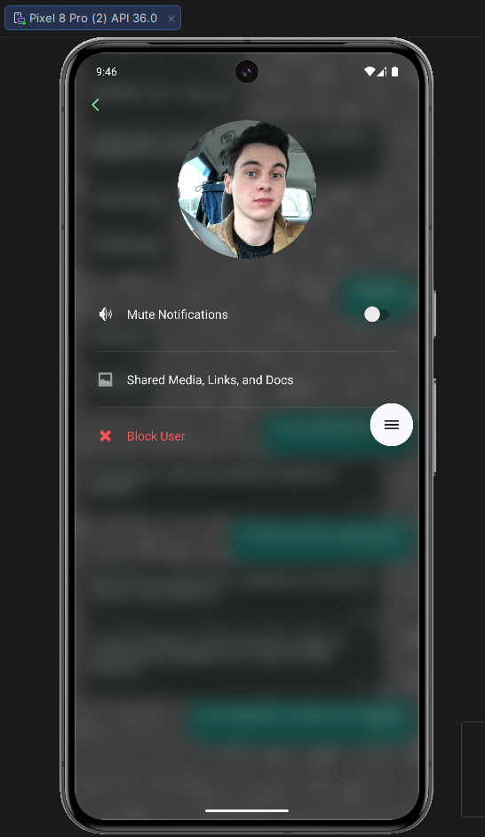

# 🦎 Gecko Chat App - Arquitectura de Microservicios Cloud-Native

Gecko Chat es una plataforma de mensajería en tiempo real construida desde cero como un "laboratorio personal" para explorar y aplicar patrones de diseño de sistemas distribuidos, arquitecturas orientadas a eventos e infraestructura nativa de la nube (*Cloud-Native*).

## 📸 Demostración y Arquitectura

### Arquitectura Backend

### Cliente Android
### Cliente Android

  

  
  
  

## 🏗️ Estructura del Sistema

El backend está diseñado utilizando un enfoque de microservicios, comunicados tanto de forma síncrona (REST/Feign) como asíncrona (Apache Kafka).

* **`api-gateway`**: Punto de entrada único. Gestiona el enrutamiento, CORS, *Rate Limiting* y valida los tokens de seguridad integrados con **Keycloak**.
* **`mobile-bff` (Backend For Frontend)**: Capa de agregación diseñada específicamente para optimizar las cargas de datos del cliente móvil Android.
* **`user-service`**: Gestiona el dominio de usuarios, preferencias y grafos de amistad (PostgreSQL).
* **`messaging-service`**: Motor principal de tiempo real utilizando WebSockets. Emplea **Redis Pub/Sub** para el *fanout* de mensajes entre múltiples instancias y notifica eventos a través de Kafka.
* **`message-persistence-service`**: Servicio dedicado al almacenamiento masivo y recuperación del historial de chats utilizando **MongoDB** para alta velocidad de lectura/escritura.
* **`media-service`**: Gestiona la subida y compresión de archivos multimedia y fotos de perfil (con integración preparada para AWS S3).

## 🚀 Tecnologías Destacadas

### Backend & Core
* **Framework:** Java 25, Spring Boot 4, Spring Cloud (Gateway, OpenFeign).
* **Seguridad:** OAuth2 + OpenID Connect (OIDC) utilizando **Keycloak**.
* **Mensajería Asíncrona:** Apache Kafka (Event-Driven Architecture).
* **Bases de Datos (Políglota):** PostgreSQL (datos transaccionales/relacionales) y MongoDB (historial de mensajes).
* **Caché y Fanout:** Redis.

### Infraestructura & Observabilidad ⭐
* **Orquestación:** Docker, Kubernetes (despliegue local validado con k3d).
* **Empaquetado Cloud:** Manifiestos de **Helm** completos para despliegue automatizado.
* **Observabilidad:** Integración con OpenTelemetry para métricas, trazas distribuidas y recolección de logs (preparado para **Grafana** / ELK).
* **CI/CD:** Pipelines de GitHub Actions.

### Cliente Frontend
* **Aplicación Android Nativa:** Desarrollada en Java siguiendo el patrón MVVM.
* **Stack:** Room (persistencia local), Retrofit (APIs), WebSockets nativos para tiempo real.
